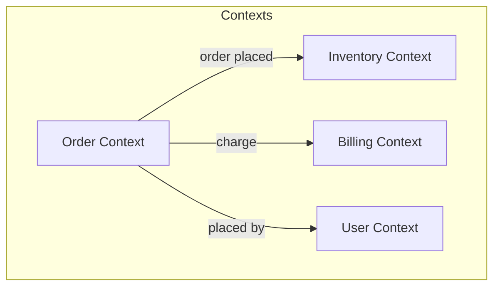
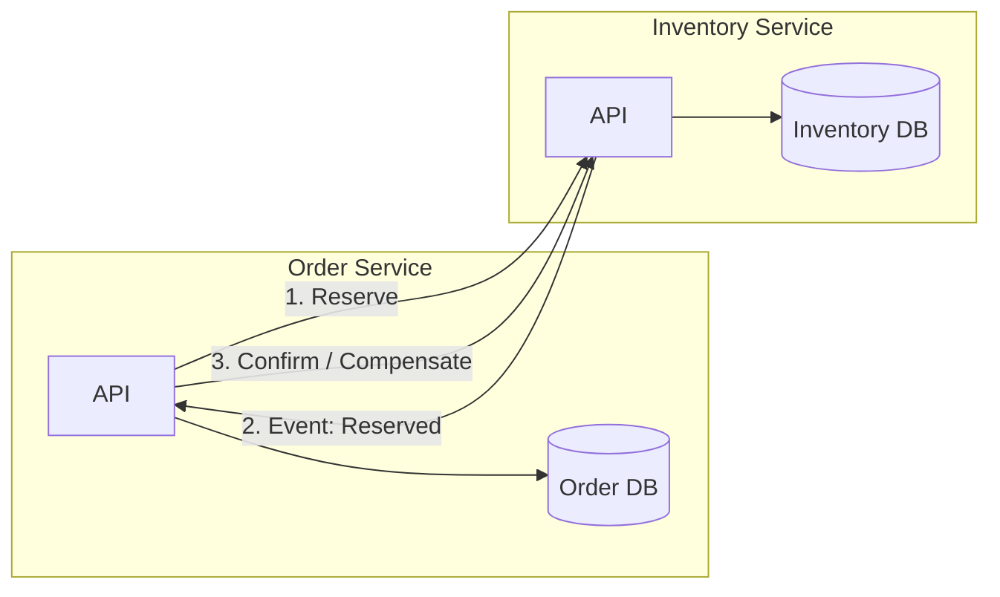
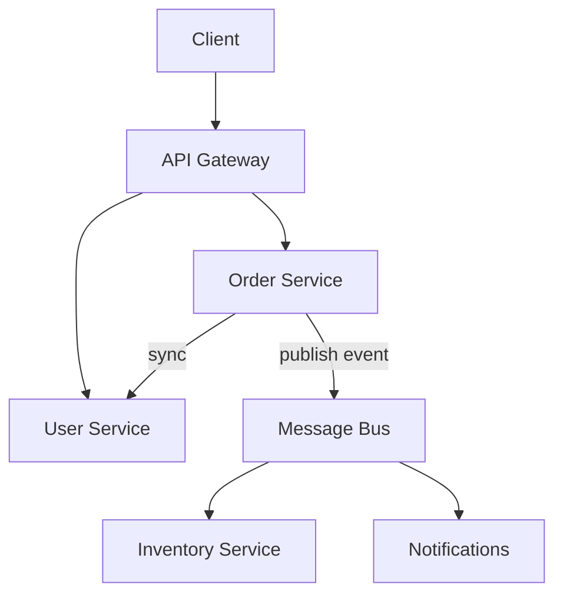

# Microservices Architecture — Design Reference

A single design view of microservices: boundaries, data, communication, and operations. Use this to confirm you can reason about the same trade-offs in an interview or on a whiteboard.

---

## 1. Design Goal & Principles

**Goal:** Many small, independently deployable services, each owning one or a few business capabilities, with clear boundaries and minimal coupling.

| Principle | Implication |
|-----------|-------------|
| **Bounded context per service** | Service = one consistency boundary; no shared DB with another service. |
| **Independent deployability** | No coordinated releases; contracts (APIs, events) are the only coupling. |
| **Decentralize wisely** | Data, tech stack, and ownership can vary per service; governance (security, observability) stays consistent. |
| **Design for failure** | Network and dependencies fail; timeouts, retries, circuit breakers, and graceful degradation are part of the design. |

---

## 2. Service Boundaries & Bounded Contexts

Services are aligned to **bounded contexts** (DDD): one place where a term or invariant has a single meaning. Boundaries are drawn by:

- **Change together** — If two areas change for the same reason (e.g. “pricing rules”), they often belong in one service until scale or team split forces a cut.
- **Consistency boundary** — What must be strongly consistent lives in one service and its DB; cross-service = eventual consistency or saga.
- **Team ownership** — One team (or squad) per service avoids constant cross-team coordination.

**Rule of thumb:** Start with fewer, slightly larger services; split when deployment cadence, scaling, or team friction justifies it. Avoid “nanoservices” (one DB table = one service).

---

## 3. Data & Consistency

- **Database per service** — Each service has its own schema/DB (or schema per service in a shared DB cluster). No direct DB access from another service.
- **Owner writes** — Only the service that owns an aggregate writes to it. Others read via API or events (or a read model they maintain from events).
- **Strong consistency** — Only within one service. Cross-service: **eventual consistency** or **saga** (compensating actions) when you need a multi-step flow with rollback semantics.

- **Saga** — Orchestration (one coordinator calls services in sequence, triggers compensations) or Choreography (services react to events; each knows its own compensation). Choreography is more decoupled but harder to reason about end-to-end.
- **Anti-pattern:** Distributed transactions (2PC) across services — avoid; use sagas or eventual consistency instead.

---

## 4. Communication

| Style | Use when | Trade-off |
|-------|----------|-----------|
| **Sync (HTTP/gRPC)** | Need immediate response (e.g. “get user”, “validate payment”). | Coupling in time and availability; caller blocks on callee. |
| **Async (events/messages)** | Fire-and-forget, eventual consistency, or fan-out (e.g. “order placed” → inventory, notifications, analytics). | Decoupled; need idempotency, ordering/partitioning, and observability. |

**API Gateway** — Single entry for clients: routing, auth, rate limit, sometimes aggregation. Services stay internal; only gateway (and maybe a BFF) talks to the outside.

**Service-to-service** — Prefer **async by default** for cross-context updates (events); use **sync** only when the caller truly needs the result in the same request.

- **Events** — Carry “what happened” (OrderPlaced, PaymentCompleted). Subscribers build their own models; no shared DB.
- **Idempotency** — Event/message handlers must be idempotent (keyed by event/message id) so retries don’t double-apply.

---

**Orchestration vs choreography** — In **orchestration**, one service coordinates the flow by calling others (sync or async). In **choreography**, services react to events; no single orchestrator. The playground implements orchestration (Order calls User); it also shows choreography-style behaviour by having Order publish an event (fire-and-forget to an audit service) so other services can subscribe.

---

## 5. Deployment & Operations

- **Independent deployment** — Each service has its own pipeline; versioning and backward compatibility (API and events) are first-class.
- **Containers** — Services run as containers (e.g. Docker); orchestration (e.g. Kubernetes) handles placement, scaling, and rollout.
- **Config** — Externalized (env, config server, secrets store); no config baked into images for env-specific values.
- **Health** — Liveness (process up) and readiness (can take traffic, DB and dependencies OK); orchestration uses these for restarts and routing.

---

## 6. Resilience & Observability

**Resilience**

- **Timeouts** — Every outbound call has a timeout to avoid hanging.
- **Retries** — With backoff and only for transient failures (e.g. 5xx, network); not for 4xx.
- **Circuit breaker** — Stop calling a failing dependency for a period; fail fast and optionally fallback (e.g. cached/default).
- **Bulkhead** — Isolate resource usage (e.g. thread pool or connection pool per dependency) so one bad dependency doesn’t starve others.
- **Graceful degradation** — Return partial data or a clear error instead of cascading failure.

**Observability**

- **Distributed tracing** — One trace id across gateway and all services so you can see the full path of a request.
- **Structured logs** — Same correlation id in logs and traces.
- **Metrics** — Latency, error rate, throughput per service and dependency; SLIs/SLOs and alerting.
- **Health endpoints** — Used by gateway and orchestrator for routing and restarts.

---

## 7. When It Fits (and When It Doesn’t)

**Fits:** Multiple teams, different scaling or release cadences per capability, need for polyglot persistence or tech, and willingness to invest in automation, observability, and contract discipline.

**Doesn’t fit:** Small team, single deployable unit is enough, or no budget for operational and architectural complexity. In those cases, a well-modularized monolith is often better.

---

## 8. Quick Self-Check

You’re in good shape if you can:

- Explain **why** “database per service” and **how** you handle cross-service consistency (events, saga, no 2PC).
- Draw **sync vs async** and when you’d use each; name trade-offs (coupling, ordering, idempotency).
- Describe **one** resilience pattern (e.g. circuit breaker) and **one** observability practice (e.g. trace id propagation).
- Justify **one** service boundary using bounded context or “change together.”
- Say when you’d **not** choose microservices (team size, complexity budget, domain maturity).

Use this doc as a mental map: same principles apply whether you’re designing from scratch or refactoring a monolith toward services.
