# Software Architecture: Patterns for Developers

## 1. Introduction

Software architecture is the set of high-level structures and decisions that shape how a system is built and run—components, their relationships, and how they communicate. Patterns give you reusable blueprints so you don’t reinvent the wheel and can reason about trade-offs (e.g. simplicity vs scale, coupling vs flexibility).

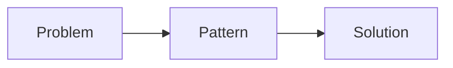

---

## 2. The Context of Software Architecture Patterns

### What are software architecture patterns?

Architecture patterns are reusable structural templates for organizing systems. They describe coarse-grained arrangements of components (e.g. layers, services, hexagons) and how data and control flow between them. Think of them as “solutions that have worked before” for recurring system-level problems.

### Why software architecture patterns?

They give teams a shared vocabulary, reduce risk by applying proven structures, and make trade-offs explicit (e.g. monolith vs microservices). Choosing a pattern narrows design space and improves consistency across the codebase.

### The difference between architecture patterns and design patterns

| Aspect | Architecture patterns | Design patterns |
|--------|------------------------|-----------------|
| **Scope** | System- or application-wide | Class/object-level |
| **Examples** | Layered, Microservices, Hexagonal | Singleton, Factory, Observer |
| **Concern** | Deployment, boundaries, data flow | Object creation, behavior, composition |

### Categories of architecture patterns

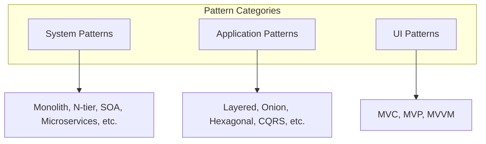

---

## 3. System Patterns

### Monolith

One deployable unit: all UI, business logic, and data access run in a single process. Simple to develop and deploy; scaling and technology evolution are harder because everything is coupled.

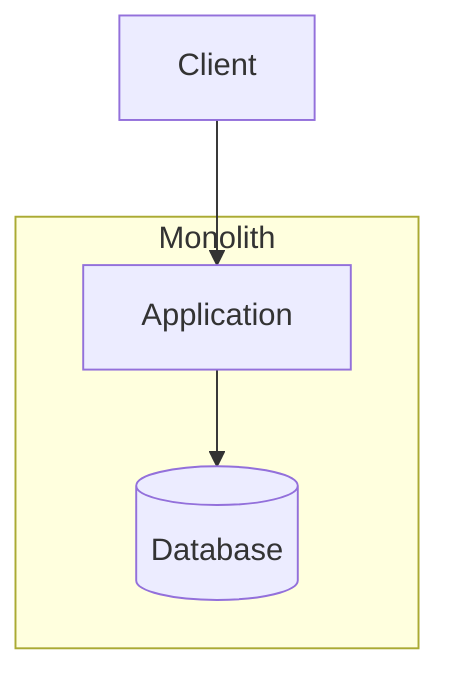

```javascript
// Single process: routes + service + DB in one app
const express = require('express');
const { getUser } = require('./services/userService');

const app = express();
app.get('/users/:id', (req, res) => {
  const user = getUser(req.params.id);
  res.json(user);
});
app.listen(3000);
```

### N-tier Architecture

Logic is split into horizontal tiers—typically Presentation (UI/API), Business (domain rules), and Data (persistence). Requests flow down and back; each tier depends only on the one below.

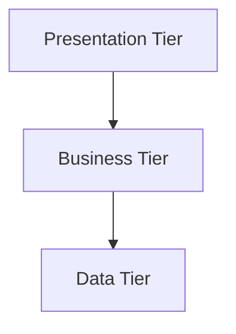

```javascript
// routes/users.js (Presentation)
const { getUserById } = require('../services/userService');
exports.getUser = (req, res) => res.json(getUserById(req.params.id));

// services/userService.js (Business)
const userRepo = require('../repositories/userRepository');
exports.getUserById = (id) => userRepo.find(id);

// repositories/userRepository.js (Data)
const db = {};
exports.find = (id) => db[id] ?? null;
```

### Service-Oriented Architecture (SOA)

Business capabilities are exposed as services; an ESB or orchestrator often routes and composes them. Services are shared and reused across consumers; they tend to be larger and more centralized than in microservices.

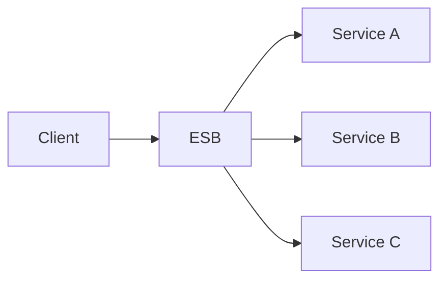

```javascript
// Consumer calls service via HTTP (or in-process interface)
const http = require('http');
const getOrder = (orderId) =>
  new Promise((resolve) => {
    const req = http.get(`http://order-service/orders/${orderId}`, (res) => {
      let data = '';
      res.on('data', (c) => (data += c));
      res.on('end', () => resolve(JSON.parse(data)));
    });
  });

// Order service (separate process) exposes /orders/:id
```

### Microservices

Independent deployable services, each owning a bounded context and often its own data store. An API gateway typically fronts them. Enables team autonomy and scaling per service; adds operational and network complexity.

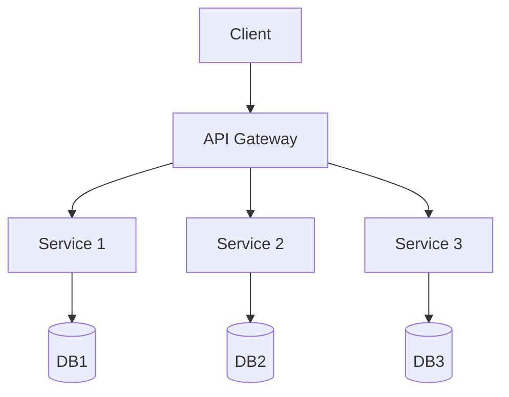

```javascript
// Service A (e.g. port 3001)
const express = require('express');
const app = express();
app.get('/users/:id', (req, res) => res.json({ id: req.params.id, name: 'Alice' }));
app.listen(3001);

// Service B calls Service A via HTTP
const fetch = require('node-fetch');
const getUser = (id) => fetch(`http://localhost:3001/users/${id}`).then((r) => r.json());
```

### Serverless Architecture

Compute runs as FaaS: event-driven functions (HTTP, queue, schedule) without managing servers. Good for sporadic or event-driven workloads; cold starts and vendor lock-in are trade-offs.

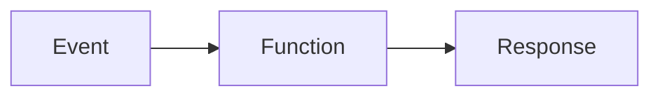

```javascript
// Lambda-style handler (Node.js)
exports.handler = async (event) => {
  const body = JSON.parse(event.body || '{}');
  const result = { message: `Processed: ${body.name}` };
  return { statusCode: 200, body: JSON.stringify(result) };
};
```

### Distributed Systems

Multiple nodes work together over a network. You deal with partial failure, latency, and CAP (Consistency, Availability, Partition tolerance). Design for failure and eventual consistency where appropriate.

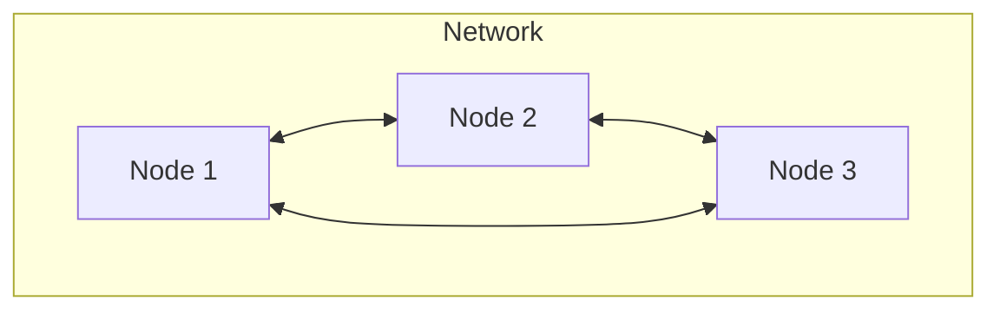

```javascript
// Simple call to another node (e.g. internal API)
const fetch = require('node-fetch');
const otherNode = async () => {
  const res = await fetch('http://node-b:4000/data');
  return res.json();
};
```

### Peer-to-Peer Architecture

No central server; peers communicate directly and share responsibility (e.g. file sharing, blockchains). Resilient and decentralized; discovery, trust, and consistency are harder.

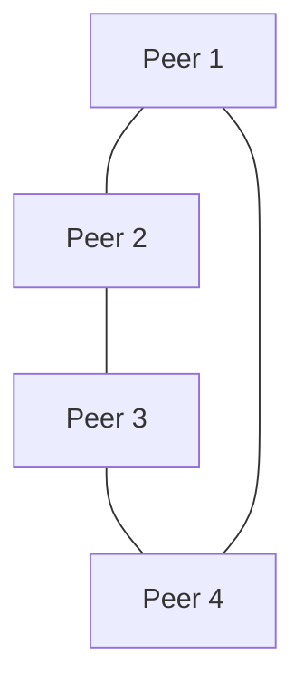

---

## 4. Application Patterns

### Layered Architecture

Strict horizontal layers: UI → Application → Domain → Data. Dependencies point downward only. Simple and familiar; the domain can be diluted if “everything” is pushed into a generic service layer.

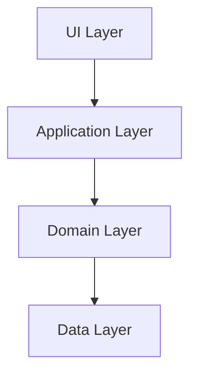

```javascript
// Controller (UI) -> Service (App) -> Repository (Data)
// controllers/userController.js
const userService = require('../services/userService');
exports.getUser = (req, res) => res.json(userService.getUser(req.params.id));

// services/userService.js
const userRepo = require('../repositories/userRepository');
exports.getUser = (id) => userRepo.findById(id);

// repositories/userRepository.js
const store = new Map();
exports.findById = (id) => store.get(id) ?? null;
```

### Onion Architecture

Domain and application rules sit at the center; infrastructure (DB, HTTP, etc.) is on the outside. Dependencies point inward. Domain stays pure and testable without external concerns.

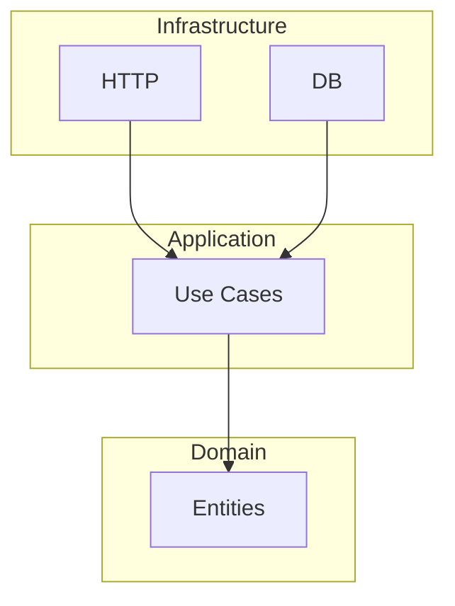

```javascript
// Domain (center): entity
const createUser = (id, name) => ({ id, name });

// Port (inbound): use case depends on interface
const getUserUseCase = (userRepo) => (id) => userRepo.get(id);

// Adapter (outbound): implements port
const inMemoryUserRepo = () => {
  const map = new Map();
  return { get: (id) => map.get(id), save: (u) => map.set(u.id, u) };
};
const repo = inMemoryUserRepo();
const getUser = getUserUseCase(repo);
```

### Ports and Adapters (Hexagonal Architecture)

Application core exposes ports (interfaces); driving adapters (HTTP, CLI) call in, driven adapters (DB, external APIs) implement outbound ports. Core stays independent of frameworks and I/O.

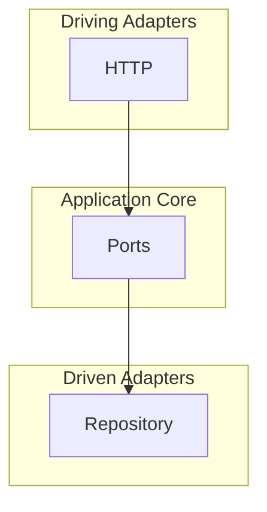

```javascript
// Port (interface)
const userPort = { getById: (id) => {} };

// Driving adapter: HTTP route
const createUserRoute = (getUser) => (req, res) => {
  const user = getUser(req.params.id);
  res.json(user);
};

// Driven adapter: in-memory repo
const inMemoryRepo = () => {
  const map = new Map();
  return { getById: (id) => map.get(id) };
};
const repo = inMemoryRepo();
const route = createUserRoute(repo.getById);
```

### Differences: Layered vs Onion vs Hexagonal

- **Layered**: Strict top-down layers; dependency direction is downward. Simple; risk of anemic domain.
- **Onion**: Domain at center; infrastructure outside; dependencies inward. Strong focus on domain purity.
- **Hexagonal**: Core with ports; adapters on both sides (driving/driven). Framework-agnostic and testable via ports.

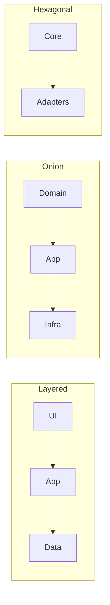

### Modular Monolith

One deployable unit, but code is split into modules (e.g. Auth, Billing, Orders) with clear boundaries and minimal cross-module coupling. Good stepping stone before or instead of microservices.

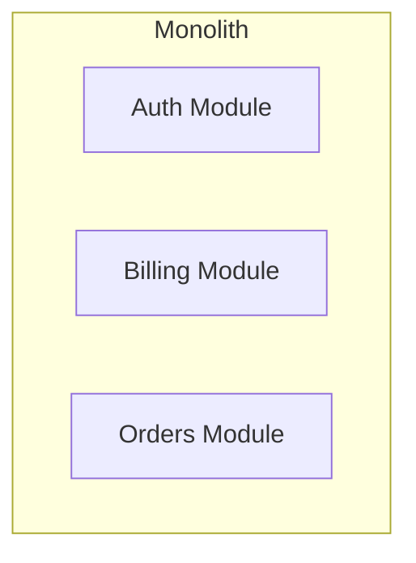

```javascript
// modules/auth/index.js
exports.authenticate = (token) => ({ userId: token ? 'u1' : null });

// modules/orders/index.js
exports.getOrder = (orderId) => ({ id: orderId, total: 99 });

// app.js: wire modules
const auth = require('./modules/auth');
const orders = require('./modules/orders');
const token = 'xyz';
if (auth.authenticate(token)) console.log(orders.getOrder('o1'));
```

### Microkernel Architecture

A minimal core provides lifecycle and extension points; plugins add features. Used in IDEs, browsers, and apps that need optional or pluggable behavior.

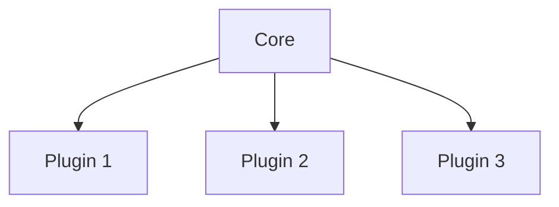

```javascript
const plugins = [];

function use(plugin) {
  plugins.push(plugin);
}

function run(input) {
  return plugins.reduce((acc, fn) => fn(acc), input);
}

use((x) => x + 1);
use((x) => x * 2);
console.log(run(5)); // 12
```

### CQRS (Command Query Responsibility Segregation)

Commands change state; queries read state. Write and read models can be separated (different schemas, stores, or scaling). Use when read and write workloads or shapes differ a lot.

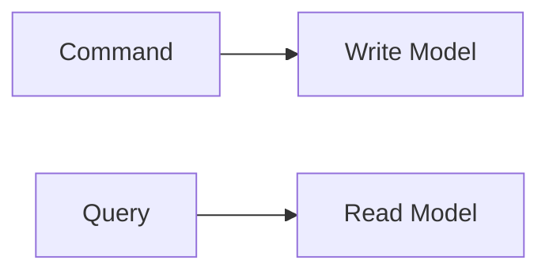

```javascript
const writeModel = new Map();
const readModel = new Map();

const commandHandler = (cmd) => {
  if (cmd.type === 'CreateUser') writeModel.set(cmd.id, { id: cmd.id, name: cmd.name });
};

const queryHandler = (query) => {
  if (query.type === 'GetUser') return readModel.get(query.id);
};

// Sync read model from write model (or from events)
const syncReadModel = () => writeModel.forEach((v, k) => readModel.set(k, v));
commandHandler({ type: 'CreateUser', id: '1', name: 'Alice' });
syncReadModel();
console.log(queryHandler({ type: 'GetUser', id: '1' }));
```

### Event Sourcing

State is not stored directly; instead, a log of events is stored. Current state is derived by replaying or reducing events. Enables audit trail, time travel, and multiple read models.

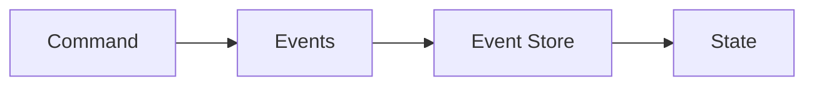

```javascript
const eventStore = [];

function apply(state, event) {
  if (event.type === 'UserCreated') return { ...state, id: event.id, name: event.name };
  if (event.type === 'NameChanged') return { ...state, name: event.name };
  return state;
}

function dispatch(event) {
  eventStore.push(event);
}

function getState() {
  return eventStore.reduce(apply, {});
}

dispatch({ type: 'UserCreated', id: '1', name: 'Alice' });
dispatch({ type: 'NameChanged', name: 'Alicia' });
console.log(getState()); // { id: '1', name: 'Alicia' }
```

### Combining CQRS and Event Sourcing

Commands produce events that are appended to the event store; the write “model” is the event log. One or more read models are built by consuming events (e.g. in a reduce or projector). Best of both: full history plus optimized reads.

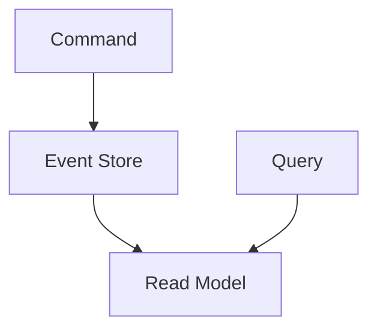

```javascript
const events = [];
const readModel = new Map();

function handleCommand(cmd) {
  if (cmd.type === 'CreateUser') events.push({ type: 'UserCreated', id: cmd.id, name: cmd.name });
}

function buildReadModel() {
  readModel.clear();
  events.forEach((e) => {
    if (e.type === 'UserCreated') readModel.set(e.id, { id: e.id, name: e.name });
  });
}

handleCommand({ type: 'CreateUser', id: '1', name: 'Bob' });
buildReadModel();
console.log(readModel.get('1'));
```

---

## 5. UI Patterns

### Forms and Controls

UI is built from forms and controls (inputs, buttons, validation). User input flows to a handler that validates and updates state or calls the backend. Foundation for most data-entry UIs.

### Model-View-Controller (MVC)

The **Model** holds data; the **View** renders it; the **Controller** handles input and updates the model (and often selects the view). Classic and widely used; view and model can become coupled if not disciplined.

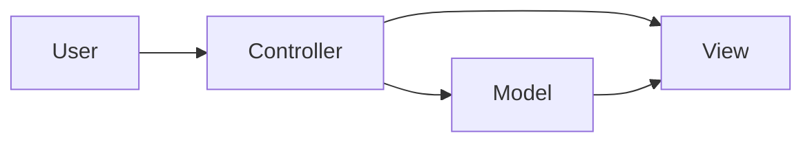

```javascript
const model = { name: '' };

function controller(action) {
  if (action.type === 'SET_NAME') model.name = action.payload;
  return view(model);
}

function view(model) {
  return `<div>Hello, ${model.name || 'Guest'}</div>`;
}

console.log(controller({ type: 'SET_NAME', payload: 'Alice' }));
```

### Model-View-Presenter (MVP)

The **Presenter** mediates between View and Model. The View is passive (callbacks/setters); the Presenter handles UI logic and updates the View. Good for testability: logic lives in the presenter.

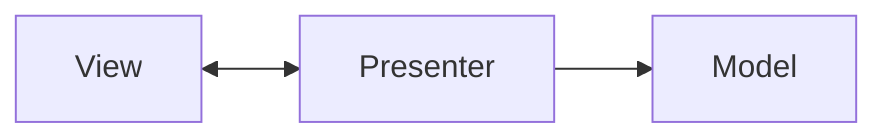

```javascript
const model = { name: 'Bob' };

function createPresenter(view) {
  return {
    onLoad() {
      view.show(model.name);
    },
    setName(name) {
      model.name = name;
      view.show(model.name);
    },
  };
}

const view = { show: (text) => console.log('View:', text) };
const presenter = createPresenter(view);
presenter.onLoad();
presenter.setName('Alice');
```

### Model-View-ViewModel (MVVM)

The **ViewModel** exposes state and commands; the **View** binds to it (data-binding). The ViewModel does not reference the View. Fits reactive UIs and binding frameworks.

```mermaid
flowchart LR
  View[View] <--> ViewModel[ViewModel]
  ViewModel --> Model[Model]
```

```javascript
const model = { name: 'Guest' };
const listeners = [];

const viewModel = {
  get name() {
    return model.name;
  },
  set name(v) {
    model.name = v;
    listeners.forEach((fn) => fn(model));
  },
  subscribe(fn) {
    listeners.push(fn);
  },
};

viewModel.subscribe((m) => console.log('Updated:', m.name));
viewModel.name = 'Carol';
```

### Differences: MVC vs MVP vs MVVM

| | MVC | MVP | MVVM |
|---|-----|-----|------|
| **UI logic** | Controller | Presenter | ViewModel |
| **View** | Renders model | Passive, callbacks | Binds to ViewModel |
| **Testability** | Moderate | High (presenter) | High (ViewModel) |
| **Binding** | Manual | Manual | Data-binding typical |

---

## 6. Conclusion

Patterns are combined in practice: e.g. **Layered + MVC** in a monolith, **Microservices + CQRS** for scalable reads/writes, **Hexagonal + Event Sourcing** for a clean, auditable core. Choose by problem: scale, team structure, and need for flexibility and testability.

```mermaid
flowchart LR
  System[System Pattern] --> App[Application Pattern]
  App --> UI[UI Pattern]
  System -.-> Combined[Combined Solution]
  App -.-> Combined
  UI -.-> Combined
```
