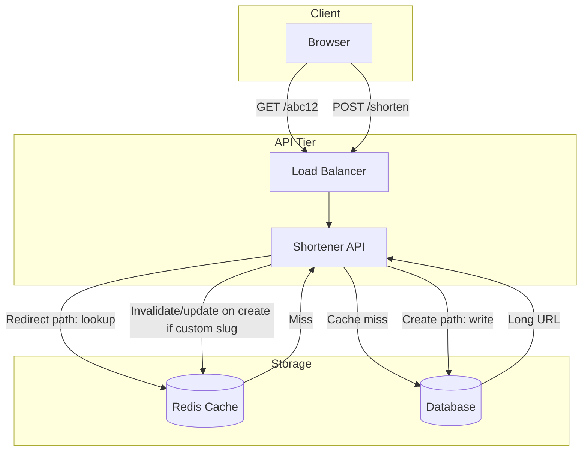

# URL Shortener

Design a URL shortener like bit.ly: given a long URL, return a short link that redirects to the original URL.

---

## Problem & scope

We need a service that (1) creates a short alias for a long URL and (2) redirects requests for the short URL to the original. Constraints: high read volume, low latency on redirect, and durable storage for the mapping. Optional: custom slugs, TTL, analytics.

---

## Requirements

**Functional**

- Shorten: accept long URL, return short URL (e.g. `https://short.ly/abc12`).
- Redirect: GET on short URL returns 302/301 to long URL.
- Optional: custom slug, expiration (TTL), click analytics.

**Non-functional**

- Low latency on redirect (cache-first; target p99 &lt; 100 ms).
- High availability (redirect path is critical).
- Scale: assume read-heavy (e.g. 10:1 read:write).

---

## High-level architecture

---

## Components

- **Load balancer** – Distributes traffic across API instances; TLS termination.
- **Shortener API** – REST: `POST /shorten` (body: long URL, optional slug) and `GET /:shortCode` (redirect). Generates short code (e.g. Base62 of auto-increment or hash), looks up in cache then DB, returns 302 or 404.
- **Redis cache** – Cache-aside: key = short code, value = long URL. Reduces DB load and redirect latency.
- **Database** – Persistent mapping: short_code (PK), long_url, created_at, optional user_id, TTL. SQL or NoSQL both work; schema is simple.

---

## Data flow

**Create (write path)**

1. Client POSTs long URL (and optional custom slug).
2. API validates URL; if custom slug, check DB for uniqueness.
3. If auto-generated: get next ID (e.g. from DB sequence or dedicated ID service), encode to Base62 → short code.
4. Write (short_code, long_url, …) to DB.
5. If custom slug or cache was pre-warmed, optionally set/invalidate cache.
6. Return short URL to client.

**Redirect (read path)**

1. Client GETs short URL (e.g. `GET /abc12`).
2. API reads short code, looks up in Redis.
3. If hit: return 302 with Location = long URL.
4. If miss: query DB; if found, populate cache and return 302; if not found, return 404.

---

## Back-of-the-envelope

**Assumptions**

- 100M new short URLs per month (~40 write QPS).
- Read:write = 10:1 → ~400 read QPS (conservative; viral links can spike).
- Store mapping for 5 years.
- ~500 bytes per row (short_code, long_url, metadata).

**QPS**

- Write QPS: 100M / (30 × 24 × 3600) ≈ **40 writes/s**.
- Read QPS: 10 × 40 = **400 reads/s** (scale up for peaks, e.g. 2–5×).

**Storage (DB)**

- Rows: 100M × 12 × 5 = **6B rows** over 5 years.
- Size: 6B × 500 bytes ≈ **3 TB** (indexes and overhead can add ~50–100%).

**Cache**

- Hot set: e.g. 20% of active mappings; 6B × 0.2 × 500 bytes ≈ **600 GB** (upper bound; in practice cache only recent/viral, e.g. 10–50 GB).
- Hit rate target: **80–95%** to keep DB load low.

**Bandwidth (redirect path)**

- 400 reads/s × ~300 bytes (HTTP redirect response) ≈ **~0.12 MB/s** (negligible); scale with read QPS.

**Scaling levers**

- Single DB can handle 40 writes/s and hundreds of reads/s with cache; shard by short_code hash when growing. More API + Redis replicas for read capacity.

---

## Trade-offs & interview points

- **Why cache?** Redirect is read-heavy and latency-sensitive; cache reduces DB load and keeps p99 low.
- **Cache-aside** – App manages cache; simple, but miss path has extra latency and thundering herd possible (mitigate with short TTL or single-flight per key).
- **Base62** – Compact, URL-safe; use auto-increment + Base62 for short codes, or hash long URL if you need idempotency (same long URL → same short URL) at cost of collision handling.
- **DB choice** – SQL: simple schema, ACID for uniqueness. NoSQL: easy horizontal sharding by short_code; eventual consistency acceptable for redirect.
- **Custom slugs** – Require uniqueness check and cache invalidation on create; consider rate limiting to avoid abuse.
- **Analytics** – Async: emit click events to queue, then analytics pipeline; avoid slowing redirect path.

---

## Scaling / failure

- **Sharding** – Partition DB by short_code (e.g. hash modulo or range) when single DB is insufficient.
- **Replication** – Read replicas for DB if cache misses are significant; Redis replicas for cache read capacity.
- **Cache invalidation** – TTL (e.g. 24–48 h) or explicit invalidation on update/delete; accept stale redirect for TTL period.
- **Single points of failure** – Multiple API instances behind LB; Redis cluster; DB primary + replicas; avoid single-node dependencies on critical path.
