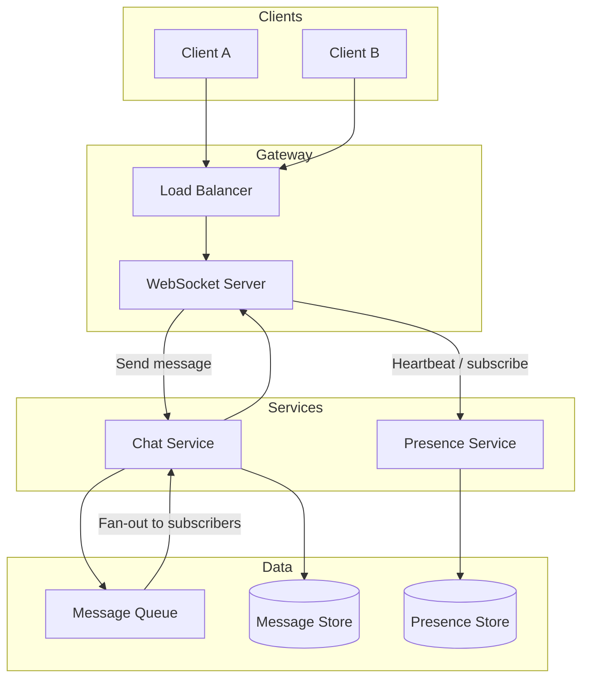

# Chat / Messaging

Design a real-time chat system (e.g. 1:1 and group messaging) with message delivery, history, and presence.

---

## Problem & scope

Users send and receive messages in near real-time in conversations (1:1 or group). The system must deliver messages with ordering per conversation, persist history for later retrieval, and support online status (presence). Scale for millions of users and high message volume.

---

## Requirements

**Functional**

- Send message to a conversation (1:1 or group).
- Receive messages in real time (push) and fetch history (pull).
- Ordering: messages in a conversation appear in consistent order.
- Optional: read receipts, typing indicators, presence (online/offline).

**Non-functional**

- Low latency for delivery (target &lt; 500 ms from send to receive).
- Durable storage for message history (e.g. 1 year).
- High availability for send and receive paths.

---

## High-level architecture

---

## Components

- **Load balancer** – Routes HTTP/WebSocket to WebSocket servers; sticky sessions (or connection routing) so a client stays on same server for that connection.
- **WebSocket server** – Keeps long-lived connections; receives send from client, pushes incoming messages to client; heartbeat for presence and connection liveness.
- **Chat service** – Handles send: validate, assign sequence/order (e.g. per conversation partition), write to message store, publish to queue for fan-out. On consume: deliver to connected subscribers’ WebSocket connections.
- **Message queue** – Kafka or similar: topic per conversation (or partition key by conversation_id). Ensures ordering per conversation and decouples write from fan-out to online users.
- **Message store (DB)** – Persist messages: conversation_id, message_id, sender_id, content, timestamp, sequence. Index by (conversation_id, timestamp) for history. Shard by conversation_id.
- **Presence service** – Tracks who is online; updates on connect/disconnect/heartbeat; stored in Redis or DB; queried for “online” indicator and typing.

---

## Data flow

**Send message**

1. Client sends message over WebSocket (or HTTP) to Chat service with conversation_id and content.
2. Chat service validates, generates message_id, assigns sequence (e.g. from DB or partition leader).
3. Write message to Message store (DB).
4. Publish to Message queue (topic/partition by conversation_id).
5. Chat service (or dedicated delivery workers) consumes from queue and pushes to all connected participants in that conversation via their WebSocket connections.
6. Return ack to sender (e.g. message_id, timestamp).

**Receive message (real-time)**

1. Subscriber is connected via WebSocket to a server that is consuming the conversation’s partition.
2. When message is consumed from queue, server pushes to that client’s WebSocket.
3. Client renders message.

**Fetch history**

1. Client requests history (e.g. GET /conversations/:id/messages?before=ts&limit=50).
2. API queries Message store by conversation_id, ordered by timestamp/sequence, paginated.
3. Return list to client.

**Presence**

1. On connect: Presence service marks user online (e.g. Redis set or DB).
2. Heartbeat (e.g. every 30 s): refresh TTL; disconnect or timeout marks offline.
3. On “get online list”: query Presence store for conversation members.

---

## Back-of-the-envelope

**Assumptions**

- 50M DAU; each user sends ~20 messages/day; average conversation has 3 participants (so ~3× receives per send).
- Retain message history for 1 year.
- Average message size 200 bytes (metadata + small text); allow 500 bytes stored per message.

**DAU and messages**

- Messages sent per day: 50M × 20 = **1B messages/day**.
- Messages received (delivered) per day: ~3 × 1B = **3B deliveries/day** (many to same user; unique messages ~1B).

**QPS**

- Write QPS (sends): 1B / 86400 ≈ **12k writes/s** (peak ~2–3× → ~30k).
- Read QPS (history): assume 2× sends for history loads → **~24k reads/s** (peak ~50k).
- Delivery (push): 3B / 86400 ≈ **35k deliveries/s** (in-memory/queue fan-out, not all DB reads).

**Storage (message history, 1 year)**

- Messages: 1B × 365 ≈ **365B messages**.
- Size: 365B × 500 bytes ≈ **180 TB** (compression and indexing will reduce; plan for sharding and retention policies).

**Message queue**

- Throughput: ~12k msgs/s produce; multiple consumers for fan-out. Partition by conversation_id (e.g. 100–1000 partitions) to preserve order and parallelism.
- Retention: e.g. 24–72 h for real-time delivery; long-term storage in DB.

**Presence**

- Active connections: assume 10% of DAU concurrent → **5M connections**. Memory per connection (e.g. 10 KB) → **~50 GB** for connection state. Presence keys: 50M users × small value → **~5–10 GB** in Redis.

---

## Trade-offs & interview points

- **WebSocket vs long polling** – WebSocket: lower latency, less overhead once connected; use long polling or HTTP as fallback where WebSocket is blocked.
- **Ordering** – Partition by conversation_id in queue and DB so all messages for a conversation are ordered; use sequence numbers or timestamps for total order.
- **Delivery guarantees** – At-least-once: consumer ack after push; idempotent by message_id on client. Exactly-once requires dedup (e.g. client or server dedup key).
- **Read receipts / typing** – Lightweight events over same WebSocket or separate channel; store last_read or typing state in Presence or a small KV store.
- **Multi-device** – Same user on multiple devices: each connection subscribes to user’s conversations; queue fan-out includes all of user’s connections.
- **History** – Paginate by timestamp or cursor; cache recent conversations in Redis for hot access.

---

## Scaling / failure

- **Sharding** – Message store and queue partitioned by conversation_id; Chat service instances consume different partitions.
- **WebSocket servers** – Scale horizontally; use sticky session or connection table so delivery layer knows which server has which user.
- **Single points of failure** – Multiple queue brokers (Kafka cluster); DB replicas; Redis cluster for presence; no single process is critical path for all users.
- **Failure** – If a WebSocket server dies, clients reconnect and fetch recent history; message queue retains until consumed, so no message loss if consumers are up.
