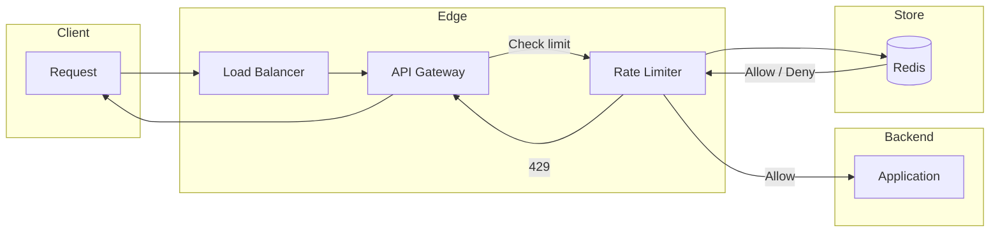

# Rate Limiter

Design a rate limiter that restricts the number of requests per user or per IP (or other key) in a time window, and returns 429 when the limit is exceeded.

---

## Problem & scope

Protect APIs from abuse and ensure fair usage by limiting request rate per identifier (user_id, API key, IP). The limiter must work across multiple API servers (distributed), enforce a defined limit (e.g. 100 req/min per user), and return 429 Too Many Requests with optional Retry-After.

---

## Requirements

**Functional**

- Allow or deny each request based on current count for the key in the current window.
- Return 429 when limit exceeded; optionally Retry-After header.
- Support multiple limits (e.g. per user, per IP, per endpoint).

**Non-functional**

- Low latency: check should add minimal delay (target &lt; 10 ms p99).
- Consistent: same key across servers should see same limit state (or accept minor drift for simplicity).
- High availability: limiter failure should fail open or closed by policy (often fail open to avoid blocking all traffic).

---

## High-level architecture

---

## Components

- **API gateway** – Single entry point; runs rate-limit check before forwarding to application. Returns 429 and Retry-After when limit exceeded.
- **Rate limiter** – Middleware or library: takes key (user_id, IP, API key), window (e.g. 1 min, 1 hour), and limit (e.g. 100). Reads/updates counter in store; allows request if under limit and increments; denies otherwise.
- **Redis** – Store for counters: key = e.g. `ratelimit:{identifier}:{window_id}`, value = count, TTL = window size. Supports atomic increment and TTL for window expiry. Alternative: in-memory per server (no cross-server consistency but simpler and faster).

---

## Data flow

**Request path**

1. Request hits API gateway with identifier (e.g. from token → user_id, or IP).
2. Gateway calls rate limiter with (key, limit, window).
3. Limiter computes current window (e.g. current minute or sliding window); fetches or initializes counter in Redis; INCR; if count &gt; limit, return “deny”; else return “allow” and optionally remaining count.
4. If allow: gateway forwards to application; if deny: gateway returns 429 and Retry-After (e.g. seconds until next window).
5. Optional: pass remaining quota in response headers (X-RateLimit-Remaining, X-RateLimit-Reset).

**Sliding window (if used)**

- Store timestamp of each request or a running count + window start; Redis sorted set or two counters (current + previous window) to approximate sliding count.

---

## Back-of-the-envelope

**Assumptions**

- 1M active users per minute; each user makes 10 requests/min on average (some burst).
- Limit: 100 req/min per user.
- Window: 1 minute; key = user_id.

**Keys and QPS to store**

- Distinct keys per minute: **1M** (one key per user per window).
- Rate-limit checks per second: 1M × 10 / 60 ≈ **170k reads/s** (each request = 1 read + 1 increment → ~340k ops/s to Redis).

**Redis memory**

- Key: `ratelimit:user:123:1699900800` (~40 bytes) + value 8 bytes + overhead ~50 bytes → **~100 bytes per key**.
- 1M keys → **~100 MB** per minute; keys expire after window (e.g. 1 min), so steady state ~100 MB. For 10 min TTL or sliding window, scale accordingly (e.g. ~1 GB).

**Redis throughput**

- 340k ops/s is within a single Redis instance (e.g. 100k+ ops/s per node); use cluster or multiple limiters sharded by key hash to scale.
- Pipelining or local cache (e.g. allow first N per key in process, then check Redis) can reduce Redis load.

**Latency**

- Single Redis round-trip: ~1–2 ms; add to gateway latency. Target p99 &lt; 10 ms for the check.

---

## Trade-offs & interview points

- **Fixed window vs sliding window** – Fixed: simple (counter per window_id); boundary burst (e.g. 100 at end of min + 100 at start of next). Sliding: smoother, no boundary burst; more state (timestamps or two counters) and slightly more logic.
- **Token bucket** – Refill tokens at constant rate; allows bursts up to bucket size. Good for “N requests per second” style limits; implement with Redis (store tokens + last refill time) or in-memory.
- **Where to place** – At gateway: single place, consistent. Per service: more control but multiple places to maintain. Edge (CDN): can limit by IP before hitting origin.
- **Distributed consistency** – Redis single-writer per key gives consistency; if you use multiple Redis nodes (sharding), same key always goes to same node. Slight over-count possible under race (two servers INCR simultaneously); usually acceptable.
- **429 and Retry-After** – Return 429 when over limit; Retry-After = seconds until next window or until one slot frees (for sliding/token bucket).
- **Fail open vs closed** – If Redis is down: fail open (allow) to avoid blocking all traffic, or fail closed (deny) for strict compliance; document the choice.

---

## Scaling / failure

- **Sharding** – Hash key (user_id) to one of N Redis nodes; each node handles a subset of keys. Throughput scales with N.
- **Local cache** – Cache “allow” for a few seconds per key to reduce Redis load; accept that limit can be exceeded by (N servers × cache TTL × rate) in worst case.
- **Single point of failure** – Redis cluster with replicas; if primary fails, promote replica. Gateway can have multiple instances; no single server owns all state.
- **Multiple limits** – Apply multiple limiters (e.g. per user + per IP); each check is independent; combine with “allow only if all pass.”
