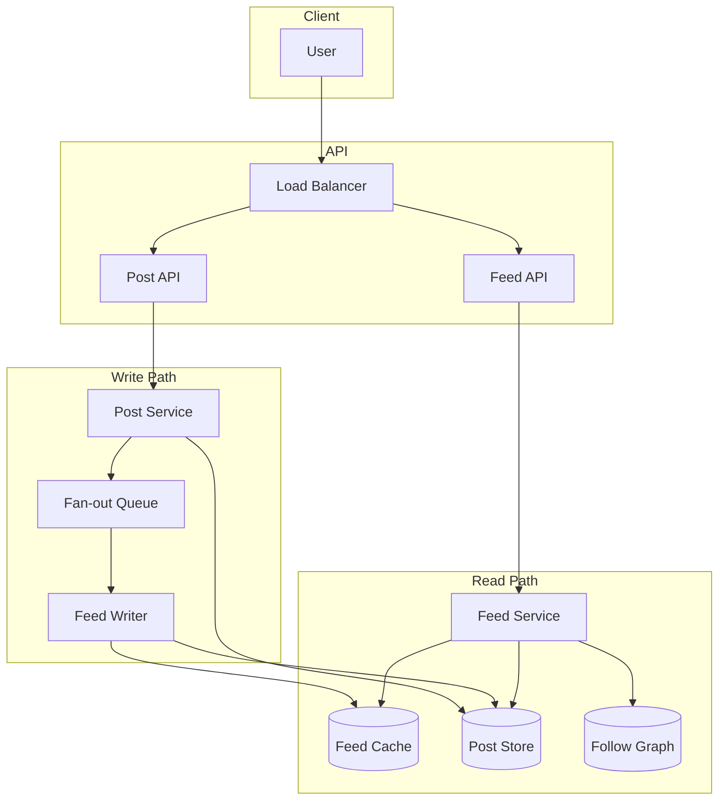

# News Feed

Design a news feed (e.g. Twitter/LinkedIn style) where users see a timeline of posts from people they follow, ordered by time or ranking.

---

## Problem & scope

Users follow other users; when they open the feed, they see a merged, ordered list of recent posts from followees. The system must support high read volume (every visit reads the feed), heavy write volume (many posts), and optional ranking (recency, engagement). Discuss fan-out on read vs fan-out on write and hybrid approaches.

---

## Requirements

**Functional**

- Post creation: user creates a post (text, media ref, etc.).
- Feed retrieval: user gets a paginated, ordered list of posts from followees.
- Optional: ranking by engagement (likes, comments), real-time insertion of new posts.

**Non-functional**

- Low latency for feed read (target p99 &lt; 200 ms).
- Consistency: new post from followee eventually appears in follower’s feed; strong consistency optional.
- Scale: millions of users, hundreds of millions of posts, high read QPS.

---

## High-level architecture

---

## Components

- **Post API / Post service** – Create post: validate, store in Post store, publish event or push to Fan-out queue (if fan-out on write). Post store: post_id, user_id, content, timestamp; shard by user_id or post_id.
- **Fan-out queue** – Kafka or similar: each post triggers jobs to “write this post into the feed cache/table of every follower.” Consumers (Feed writers) read and populate per-user feed.
- **Feed writer** – Consumes fan-out: for each (post, list of followers), appends post to each follower’s feed in Feed cache or Feed table. Can batch for efficiency.
- **Feed cache** – Per-user feed: sorted set or list of post_ids (or post refs) ordered by time/score. Redis sorted set or dedicated feed table (user_id, post_id, timestamp); TTL or size cap (e.g. last 500 items).
- **Feed service** – On feed read: get user_id → read feed from Feed cache (or merge from Graph + Post store if fan-out on read). Hydrate post details from Post store; apply ranking if needed; paginate and return.
- **Follow graph** – Stores who follows whom (user_id → list of followee_ids). Used for fan-out on write (who to write to) and fan-out on read (whose posts to merge).

---

## Data flow

**Fan-out on write (write path)**

1. User creates post → Post service writes to Post store and publishes (post_id, author_id) to Fan-out queue.
2. Fan-out consumer loads list of followers for author_id from Follow graph.
3. For each follower (or in batches), append (post_id, timestamp) to that follower’s feed in Feed cache or Feed table.
4. Done; follower’s next feed read will see the post.

**Fan-out on read (alternative read path)**

1. User requests feed → Feed service gets user’s followees from Follow graph.
2. For each followee (or top-N active), fetch latest posts from Post store (or post cache).
3. Merge and sort by timestamp (or score); paginate; return. No per-user feed table; merge on every read.

**Hybrid**

- Fan-out on write for “celebrities” (too many followers → write to feed table is expensive); fan-out on read for them when building feed.
- Fan-out on write for “normal” users so their followers get fast feed read from cache.

**Read path (with fan-out on write)**

1. Client requests feed (e.g. GET /feed?limit=20&cursor=...).
2. Feed service reads user’s feed from Feed cache (list of post_ids + timestamps).
3. If cache miss: build from Feed table or fallback to fan-out on read.
4. Hydrate post content from Post store (batch by post_ids); apply ranking if needed; return page.

---

## Back-of-the-envelope

**Assumptions**

- 200M DAU; each user posts 2 times/day; each user follows 200 people on average; each user opens feed 5 times/day.
- Feed size per user: show last 500 post refs; store 1000 in cache/table.
- Post ref size: ~50 bytes (post_id, author_id, timestamp); post content ~500 bytes stored separately.

**Write QPS**

- Posts per day: 200M × 2 = 400M → **400M / 86400 ≈ 4.6k writes/s** (peak ~3× → **~14k/s**).

**Read QPS**

- Feed reads per day: 200M × 5 = 1B → **1B / 86400 ≈ 12k reads/s** (peak ~3× → **~36k/s**).

**Fan-out on write cost**

- For each post, write to N followers’ feeds. Average N = 200 → 4.6k × 200 = **920k feed writes/s** (peak ~2.8M/s). This is the main scaling challenge; hence hybrid (don’t fan-out for users with millions of followers).

**Storage**

- Post store: 400M × 365 × 500 bytes ≈ **73 TB/year** (with indexes and replication).
- Feed cache/table: 200M users × 1000 refs × 50 bytes ≈ **10 TB** (or Redis: 200M × 1000 × 50 ≈ 10 TB; in practice cache only active users, e.g. 20% → 2 TB).
- Follow graph: 200M × 200 × 8 bytes (followee_id) ≈ **320 GB** (compressed or stored as adjacency list).

**Cache hit rate**

- Target **90%+** for feed read from Feed cache so merge-on-read is rare; TTL or refresh on scroll.

---

## Trade-offs & interview points

- **Fan-out on write** – Pro: feed read is a simple lookup (fast, scalable read). Con: huge write amplification (one post → N follower writes); celebrities with millions of followers make this expensive. Mitigation: hybrid (fan-out on read for celebrities).
- **Fan-out on read** – Pro: no write amplification; simple write path. Con: every feed read merges many users’ posts (heavy read path, more latency). Good when follow graph is small or read QPS is low.
- **Ranking** – Store engagement (likes, comments) and score posts by recency + engagement; compute score at read time or precompute and store in feed with score; re-rank top-K in service.
- **Pagination** – Cursor-based (e.g. timestamp or post_id) to avoid skip/offset; stable order (e.g. by timestamp desc).
- **Real-time** – New posts can be pushed via WebSocket or polling; or next feed pull includes them (eventual consistency).

---

## Scaling / failure

- **Sharding** – Post store: shard by user_id or post_id. Feed table/cache: shard by user_id (each user’s feed on one shard). Follow graph: shard by user_id.
- **Celebrity handling** – Don’t fan-out for users with &gt; 100k followers; at read time, merge their recent posts (fan-out on read for them only).
- **Feed writer scaling** – Many consumers for fan-out queue; partition by author_id so one author’s fan-out is ordered; batch writes to feed store to reduce IO.
- **Single points of failure** – Multiple Feed/Post service instances; queue cluster; DB and cache replicas; no single node for all users.
