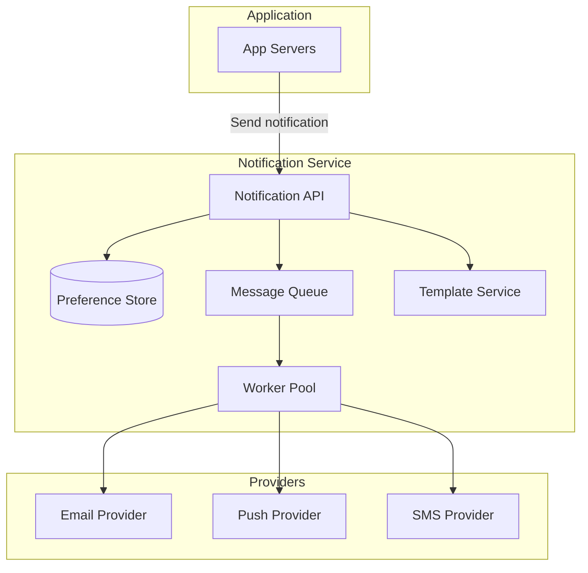

# Notification Service

Design a notification system that delivers messages to users over multiple channels (email, push, SMS, in-app) asynchronously, with retries and user preferences.

---

## Problem & scope

Applications trigger notifications (e.g. “order shipped,” “new follower”) that must be sent via one or more channels (email, push, SMS, in-app). The system accepts notification requests asynchronously, respects user preferences and rate limits per channel, and retries on failure. Idempotency and delivery tracking are important.

---

## Requirements

**Functional**

- Accept notification request: user_id, channel(s), template/key, payload, optional idempotency key.
- Deliver to the chosen channel(s) via external providers (SendGrid, FCM, Twilio, etc.).
- Optional: user preferences (opt-in/out per channel), template rendering, delivery status.

**Non-functional**

- Async: API returns quickly; delivery happens in background.
- At-least-once delivery with retries and DLQ for failures.
- Idempotent: same idempotency key not delivered twice within a window (e.g. 24 h).
- Respect provider rate limits and user-level rate limits per channel.

---

## High-level architecture

---

## Components

- **Notification API** – Receives request: user_id, channel (email/push/SMS/in-app), template_id, payload, idempotency_key. Checks user preferences (Pref store); resolves template (Template service); enqueues one or more messages (per channel) to Message queue; returns 202 Accepted with request_id.
- **Preference store** – DB or cache: user_id → channels enabled (email: true, push: false, etc.), optional per-category preferences. API skips channels user has disabled.
- **Template service** – Renders template (e.g. “Hello {{name}}, your order {{order_id}} shipped”) with payload; returns subject + body for email, title + body for push, etc.
- **Message queue** – Kafka, SQS, or similar: topics or queues per channel (email, push, SMS) or single queue with channel in message. Enables parallel workers and retry per channel. Message: user_id, channel, rendered content, provider payload, idempotency_key, created_at.
- **Worker pool** – Consumers: read from queue, call provider API (email/push/SMS), handle rate limits (backoff/retry), on success ack; on failure retry with backoff, then send to DLQ after N retries. Optional: record delivery status in DB.
- **Providers** – External: SendGrid (email), FCM/APNs (push), Twilio (SMS). Workers translate internal payload to provider format and respect provider limits.

---

## Data flow

**Send notification**

1. App calls Notification API with (user_id, channel, template_id, payload, idempotency_key).
2. API checks idempotency: if key seen in last 24 h and delivered, return 200 (no-op). Else proceed.
3. API loads user preferences; filters to allowed channels (e.g. only email and push).
4. API loads template and renders with payload (or Template service does it).
5. For each channel, enqueue message to queue (with idempotency_key, user_id, rendered content).
6. Return 202 with request_id.

**Delivery (worker)**

1. Worker dequeues message (e.g. email).
2. Worker checks idempotency again (e.g. DB or Redis: “delivered:idempotency_key”); if already delivered, ack and skip.
3. Worker calls provider (e.g. SendGrid); on success: mark delivered (idempotency store), ack. On failure (4xx/5xx): retry with backoff; after N retries, send to DLQ and ack (to avoid poison message).
4. Optional: write delivery event to analytics or status DB.

**Rate limiting**

- Per provider: respect provider’s QPS/cost limits; use token bucket or queue per provider.
- Per user per channel: e.g. max 1 email per 5 min; worker or separate rate limiter (Redis) before calling provider.

---

## Back-of-the-envelope

**Assumptions**

- 100M DAU; each user receives 5 notifications/day on average across channels; mix: 60% push, 30% email, 10% SMS.
- Idempotency window: 24 h; store delivered keys in Redis or DB (e.g. 50 bytes per key).
- Peak factor: 2× average.

**Notification volume**

- Per day: 100M × 5 = **500M notifications**.
- Per second (avg): 500M / 86400 ≈ **5.8k/s**; peak **~12k/s**.

**Queue**

- Throughput: **~12k msgs/s** enqueue; same for dequeue. Partition by channel or user_id for parallelism. Retention: 24–72 h for retries.
- Depth: at 12k/s and 1 min average processing, steady-state **~720k messages** in queue (or less if workers keep up).

**Workers**

- Assume 100 ms per provider call (email/push/SMS) → 10 requests/s per worker. To handle 12k/s: **~1.2k workers** (or fewer if batching). Scale with partitions.

**Idempotency store**

- 500M unique notifications/day; assume 20% duplicate keys (same key within 24 h) → 400M unique keys. Store 24 h: 400M × 50 bytes ≈ **20 GB** (or TTL 24 h in Redis; evict after 24 h).

**DLQ**

- Assume 0.1% failure after retries → 500k/day to DLQ; retain for manual replay or alerting.

---

## Trade-offs & interview points

- **Idempotency** – Key from app (e.g. event_id + user_id + channel); store “delivered” in Redis or DB with TTL 24 h; worker checks before calling provider and marks after success.
- **Sync vs async** – Async (queue) decouples app from provider latency and failures; app gets 202 and can poll status or rely on webhooks for delivery confirmation.
- **Per-channel queue vs single queue** – Per-channel: isolate burst (e.g. email spike) and scale workers per channel. Single queue: simpler; route in worker by channel.
- **Batching** – Email providers often support batch API; worker can batch 100 emails per call to reduce provider calls and cost.
- **User preferences** – Stored in DB; cache in Redis for API; respect before enqueue to avoid wasting queue and provider calls.
- **Retries and DLQ** – Exponential backoff (e.g. 1s, 2s, 4s); after 3–5 retries move to DLQ; monitor DLQ for provider issues.

---

## Scaling / failure

- **Workers** – Scale consumer count with queue partitions; one partition per worker (or group) for ordering if needed (e.g. per user).
- **Provider failure** – Retries and DLQ; circuit breaker if provider is down (fail fast, then retry later). Fallback channel (e.g. email if push fails) is product decision.
- **Single points of failure** – Multiple API instances; queue cluster; multiple workers; idempotency store (Redis cluster or DB) with TTL so it doesn’t grow forever.
- **Rate limits** – Centralized rate limiter (Redis) per provider and optionally per user per channel; workers check before calling provider or use provider’s rate limit headers and backoff.
