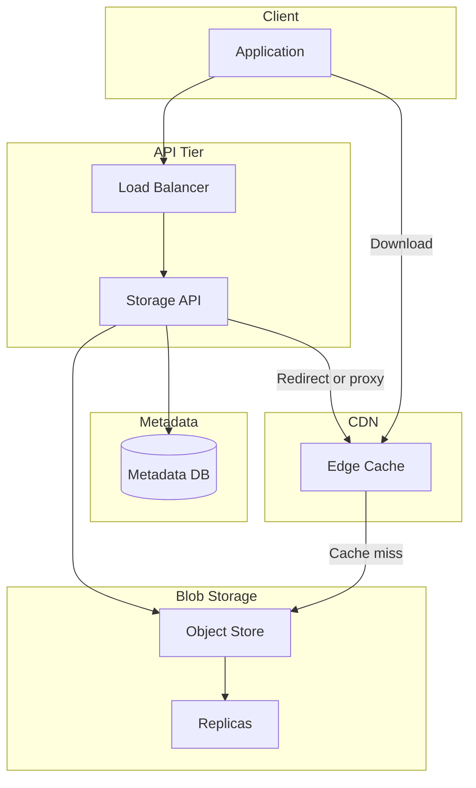

# Distributed File / Blob Storage

Design a distributed storage system for large files (e.g. S3-like or image/video storage): upload, download, metadata, and optional CDN for reads.

---

## Problem & scope

Users upload and download files (documents, images, video). The system stores blob data durably and separately from metadata (filename, user, permissions, size). Scale to billions of objects and petabytes; support multipart upload for large files; optional CDN for hot content and image processing (e.g. thumbnails).

---

## Requirements

**Functional**

- Upload: accept file (or multipart), store blob and metadata; return file_id or URL.
- Download: by file_id or path; return blob (or redirect to CDN/blob URL).
- Optional: list by user or path, delete, overwrite, versioning.

**Non-functional**

- Durable: no data loss; replication across nodes/regions.
- High throughput for read and write; low latency for metadata, acceptable latency for large blob transfer.
- Scale: billions of objects, PB-scale storage.

---

## High-level architecture

---

## Components

- **Storage API** – REST: PUT/POST upload (single or multipart), GET download (return blob or redirect to signed CDN/blob URL), DELETE, LIST. Validates auth and permissions using metadata; generates file_id (UUID or hash); writes metadata to Metadata DB; writes blob to Object store (or hands off to blob service via internal API).
- **Metadata DB** – Relational or NoSQL: file_id (PK), user_id, path/name, size, content_type, created_at, checksum, blob_location (e.g. bucket + key). Index by user_id and path for list. Shard by user_id or file_id.
- **Object store (blob)** – S3-like: bucket + key (e.g. file_id or hash); store blocks or whole object; replicate across nodes/racks. Multipart: upload parts, then complete (assemble or reference parts). No semantic meaning; just bytes keyed by (bucket, key).
- **CDN** – Cache GET responses (or signed URLs to blob) at edge; TTL based on content type; reduce load on origin and latency for hot files. On miss, CDN fetches from origin (API or blob store) and caches.

---

## Data flow

**Upload (single)**

1. Client PUTs file to API (auth token, path/name).
2. API validates auth, generates file_id, computes checksum (optional).
3. API writes metadata (file_id, user_id, path, size, blob_key) to Metadata DB.
4. API streams or writes body to Object store at blob_key (e.g. bucket = user_id or hash prefix, key = file_id). Object store replicates to N nodes.
5. API returns 201 with file_id or URL.

**Upload (multipart)**

1. Client initiates multipart upload → API returns upload_id.
2. Client uploads parts (part numbers 1..N); each part stored in Object store under upload_id + part_number.
3. Client calls complete with list of parts; API assembles (or stores manifest); writes final blob and metadata; deletes part objects.
4. Return file_id.

**Download**

1. Client GETs file by file_id or path.
2. API resolves path to file_id, checks permissions in Metadata DB, gets blob_key.
3. Option A: API returns 302 redirect to signed CDN URL (or signed blob URL). Client and CDN fetch from blob store on miss.
4. Option B: API streams from blob store to client (no CDN). Prefer CDN for read-heavy, cacheable content.

**List**

1. Client GETs list (e.g. by user_id or path prefix).
2. API queries Metadata DB (indexed by user_id/path); returns paginated list of file_id, name, size, etc.

---

## Back-of-the-envelope

**Assumptions**

- 50M DAU; each user uploads 10 files/day (avg 5 MB); read:write ratio 5:1 (each file downloaded 5 times on average over its lifetime).
- Retention: assume 1 year active growth; then steady state with deletes.
- Metadata: 500 bytes per file (file_id, user_id, path, size, blob_key, etc.).

**Upload (write) QPS**

- New files per day: 50M × 10 = 500M (aggressive; assume 100M/day for safety) → **100M / 86400 ≈ 1.2k writes/s** (peak ~3× → **~3.5k/s**).

**Download (read) QPS**

- Reads: 5× writes over lifetime; assume daily read volume 5 × 100M = 500M → **500M / 86400 ≈ 5.8k reads/s** (peak ~10k/s). CDN absorbs 80% → **~2k/s** to origin.

**Storage (blob)**

- Per day: 100M × 5 MB = **500 TB/day** (upper bound); assume 10M files × 5 MB = 50 TB/day → **~18 PB/year** without deletion. With deletion and average file size 2 MB: **~2 PB/year**.
- Metadata: 100M × 365 × 500 bytes ≈ **18 TB** (1 year); indexes add ~2× → **~36 TB**.

**Bandwidth**

- Upload: 3.5k writes/s × 5 MB ≈ **17.5 GB/s** (multipart and parallel uploads spread load).
- Download: 10k reads/s × 2 MB (avg) ≈ **20 GB/s**; with 80% CDN hit, origin egress **~4 GB/s**.

**CDN**

- Cache hit rate target: **80–90%** for hot content (recent uploads, popular files). Cache size: e.g. 10% of active blob set → hundreds of TB at edge (distributed).

---

## Trade-offs & interview points

- **Metadata vs blob separation** – Metadata in DB (query, list, permissions); blob in object store (durable, cheap, no query). Clear separation of concerns and scaling (scale blob storage independently).
- **Partitioning** – Metadata: shard by user_id (list by user) or file_id (lookup by id). Blob: partition by file_id or hash of file_id to spread load; avoid hot partitions (e.g. one user with huge traffic).
- **Consistency** – Metadata and blob: write metadata after blob is written (or use two-phase); on read, if metadata says “exists,” blob should be available (eventual consistency acceptable for blob existence after upload).
- **Multipart** – For large files (&gt; 100 MB): avoid timeouts, allow resume, parallelize parts; store parts then complete; delete parts on abort or expiry.
- **CDN** – Signed URLs (short-lived) for private content; public URLs for public content. Reduces origin load and latency; TTL and invalidation on update/delete.
- **Replication** – Blob: replicate each object to N nodes/regions for durability (e.g. 3 replicas); metadata: DB replication (primary-replica or multi-writer).

---

## Scaling / failure

- **Sharding** – Metadata DB: shard by user_id or file_id. Object store: partition by bucket + key hash across storage nodes; add nodes to increase capacity.
- **Replication** – Blob: synchronous or async replicate to multiple racks/regions; quorum write/read for durability. Metadata: primary-replica failover.
- **Single points of failure** – Multiple API instances; metadata DB with failover; object store with no single node (distributed storage cluster); CDN is multi-site.
- **Checksum** – Store hash on upload; verify on read (or on upload to detect corruption); repair from replica if mismatch.
