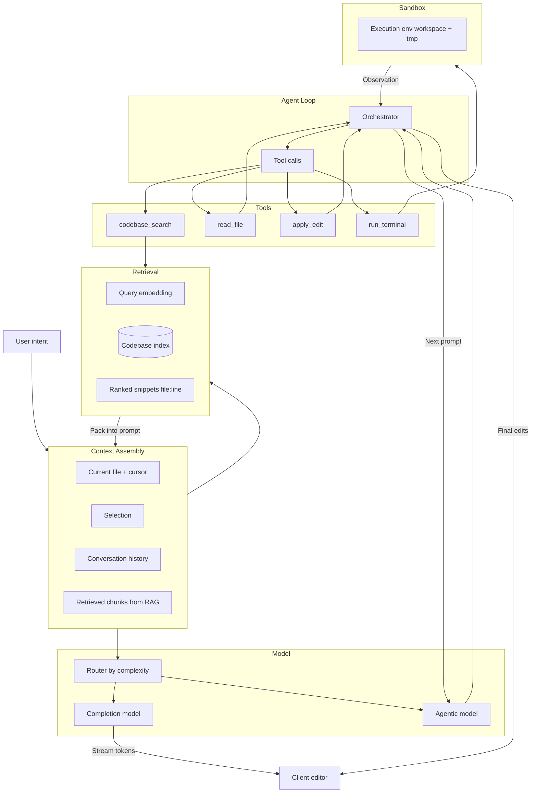

# AI Code Editor

Design the **AI system** for an AI-powered code editor (Cursor/Copilot-style): context representation and retrieval, model and tool design, agent loop, and safe execution.

---

## Problem & scope

Design the AI system that powers an AI code editor: how context is represented and retrieved, how the model and tools are designed, how the agent loop works, and how quality and safety are evaluated. Scope: **tab autocomplete**, **inline edit** (e.g. Cmd+K), and **agent** (multi-file tasks, terminal, iterate until tests pass). Focus on context design, model/tool design, agent loop, and evaluation—not generic API/DB scaling.

---

## Requirements

**Functional (AI capabilities)**

- Tab completion: next-token (or line) prediction given current file and cursor context.
- Inline edit: selection + natural-language instruction → precise edit (diff or search_replace).
- Agent: user goal → search codebase, read/write files, run terminal → iterate until task done (e.g. tests pass).
- Optional: chat, multi-file refactor, debug mode.

**Non-functional (AI design)**

- **Context quality**: Retrieved code must be relevant to the ask; context window is limited (e.g. 32K–200K tokens).
- **Edit correctness**: Edits must apply cleanly (no line drift, preserve formatting); high accept rate, low breakage.
- **Latency**: Completion &lt; ~300–500 ms so suggestion matches current context; agent turn bounded (e.g. &lt; 30 s); compounding over tool rounds.
- **Safety**: All execution (terminal, file writes) in sandbox; no arbitrary host access.

---

## High-level architecture

---

## Components

- **Context design** – What goes in the prompt and in what order: system prompt, current file and cursor, selection, retrieved code chunks, conversation history, tool results. Token budget per section; strategies for long conversations (summarize, truncate, compact).
- **Codebase indexing (for RAG)** – Parse (e.g. Tree-sitter AST) → chunking (semantic boundaries: function, class, block; stay under token limit) → embed (code-capable embedding model) → vector DB. Incremental update (changed files only; Merkle or mtime). Per-repo or per-workspace index.
- **Retrieval** – Query from user or last assistant turn; embed query; vector search (k-NN) over code chunks; optional hybrid (keyword + semantic). Rank and dedupe; return file path + line range + snippet; pack into prompt under token budget.
- **Model(s)** – (1) **Completion model**: next-token prediction, small context (current file + maybe few chunks), optimized for latency (MoE, KV cache, speculative decoding). (2) **Agentic model**: long context, tool-calling, trained on trajectories (reason → tool → observe); edit quality via (original, edit_cmd, final) and search_replace-heavy data.
- **Tool design** – Tool schema (name, description, parameters). Tools: **codebase_search**(query), **read_file**(path), **apply_edit**(path, old_string, new_string) or diff, **run_terminal**(command). Training: many trajectories that use these tools so the model learns when and how to call them.
- **Agent loop (orchestrator)** – ReAct-style: (thought → action → observation)* until model outputs final answer. Prompt = system + context + conversation + tool results; parse model output for tool_calls; execute in sandbox; append observation; re-prompt. **Context compaction** between turns: summarize long tool output, keep failing test names/errors, drop redundant code.
- **Edit application and validation** – Apply patch or search_replace; optional syntax/parse check; rollback or surface error to model for retry.
- **Sandbox (AI safety boundary)** – Isolated env for run_terminal (and optionally file writes); restrict filesystem to workspace + /tmp; block network by default; time/resource limits. Design choice: local vs cloud (latency vs scale).

---

## Data flow

**Tab completion**

1. Cursor + current file (prefix) → optional lightweight retrieval.
2. Completion model receives minimal context.
3. Stream tokens to client; apply in editor. Focus: minimal context, maximum speed.

**Inline edit**

1. Selection + instruction + file context + optional retrieval.
2. Edit model produces diff or search_replace args.
3. Apply + validate → show in editor.

**Agent turn**

1. User message + conversation + initial retrieved context.
2. Orchestrator builds prompt → agentic model.
3. Model outputs tool_calls (e.g. search, read_file, apply_edit, run_terminal).
4. Execute in sandbox; observations returned to orchestrator.
5. Context compaction (summarize logs, keep failing tests, drop redundant snippets).
6. Next prompt; repeat until final answer.
7. Final turn: summary + list of edits; apply edits with validation.

---

## Back-of-the-envelope

**Context window**

- e.g. 32K–200K tokens; completion uses small slice (2–8K); agent uses large slice (50–100K) with retrieval.

**Tokens per request**

- Completion: ~2K in, ~50 out (streaming).
- Agent turn: ~50K in (with retrieval), ~500 out; 5–10 tool calls per task → compaction critical.

**Retrieval**

- Index 10K–100K chunks per repo; embed dimension 256–1536; k = 5–20 chunks per query; retrieval latency &lt; 50–100 ms so it does not dominate agent turn.

**Edit success**

- Target high accept rate (e.g. &gt; 80% of edits applied without user fix); measure breakage (tests fail after edit); train on edit trajectories to improve.

**Scale (for capacity)**

- 1M DAU, 50 completions/user/day, 5 agent sessions × 10 turns → order of ~580 completion QPS and ~580 agent-turn QPS; agent dominates token cost (large context + many turns).

---

## Trade-offs & interview points

- **Full context vs RAG** – Full codebase does not fit; RAG gives relevant subset. Trade-off: retrieval recall vs latency and indexing cost; hybrid and query reformulation can help.
- **More tools vs simpler loop** – More tools (e.g. run_linter, run_test) give power but require more training data and careful schema; start minimal (search, read, edit, terminal).
- **Single model vs routed** – One model simpler; routing by complexity (completion vs edit vs agent, or Auto) improves latency and cost for simple requests.
- **Diff vs search_replace** – Raw diff flexible but brittle (line numbers); search_replace robust; train on both with emphasis on search_replace for reliability.
- **Streaming vs batch** – Streaming improves perceived latency (time to first token, chunked edits); use streaming for UX.
- **Offline metrics vs user acceptance** – Pass@k and edit accuracy matter, but **adoption and accept rate** are ultimate signals; evaluate on real usage and A/B.

---

## Scaling / failure

- **Context length** – Hard limit on context window; compaction and retrieval quality determine how much “working memory” the agent has.
- **Retrieval quality** – Poor retrieval → irrelevant code in prompt → worse edits; improve chunking, embedding model, and query formulation; monitor retrieval recall in logs.
- **Model fallback** – If agentic model is slow or down, fall back to smaller model or read-only mode; degrade gracefully.
- **Edit rollback** – On apply failure or validation failure, rollback and feed error back to model for retry.
- **Sandbox** – Resource and time limits to avoid runaway agent; kill and recycle sandbox on timeout.
