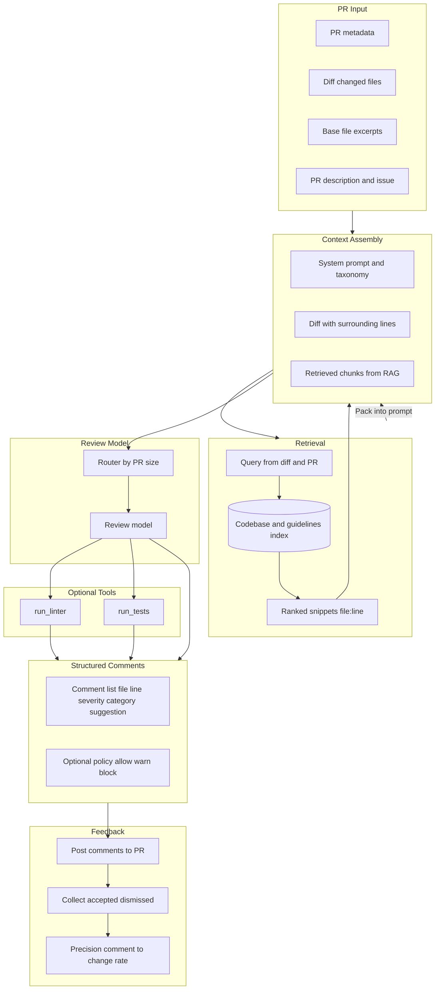

# AI Code Reviewer

Design the **AI system** for automated code review (PR/diff review): context assembly (diff, base, RAG), structured review output, and evaluation driven by developer acceptance.

---

## Problem & scope

Design the AI system for automated code review: how context is assembled (diff, base files, PR/issue text, retrieved code), how the model produces structured, actionable feedback, and how review quality and developer acceptance are evaluated. Scope: **PR/diff review** (comments with file, line, severity, category, suggestion); optional policy (allow/warn/block), optional tools (linter, tests). Focus on context design, model and output schema, review taxonomy, evaluation—not webhook/CI plumbing.

---

## Requirements

**Functional (AI capabilities)**

- Ingest PR/diff (changed files, base version, PR description, optional issue link).
- Produce **structured review comments**: file path, line range, severity (e.g. critical/major/minor), category (e.g. security, style, logic, tests, docs), and optional suggested fix or explanation.
- Optional: run linter/tests and incorporate results; policy decision (allow/warn/block) for CI; explain or suggest fix in natural language.

**Non-functional (AI design)**

- **Context quality**: Combine diff, base file context, PR/issue text, and retrieved related code (RAG) within context window; balance coverage vs token budget.
- **Comment relevance and actionability**: High precision to limit noise; comments that lead to code changes (developer acceptance) as key signal.
- **Latency**: Review completion within CI budget (e.g. &lt; 2–5 min for typical PR); optional fast path for trivial diffs.
- **Evaluation**: Track precision, recall (vs ground truth where available), and comment→change rate; avoid flooding developers with low-value comments.

---

## High-level architecture

---

## Components

- **Context design** – What goes in the prompt: system prompt (review policy, taxonomy), diff with optional surrounding lines, base file excerpts, PR title/description, issue body, retrieved code chunks (related files, similar patterns, coding guidelines). Token budget per section; strategies for large PRs (prioritize by file importance, chunk diff).
- **Codebase / guidelines indexing (for RAG)** – Index repo (and optionally org guidelines); parse → chunk (e.g. by symbol or file); embed; vector store. Query: changed symbols, file paths, PR description. Return related implementations, patterns, style guides. Incremental index on repo change.
- **Retrieval** – Query from diff (symbols, imports, file paths) and/or PR description; vector search + optional keyword; rank and dedupe; return file:line + snippet; pack into prompt under token budget.
- **Review model** – General LLM or review-finetuned model; **structured output** (e.g. JSON: list of comments with file, line_range, severity, category, message, suggestion). Prompt: role (code reviewer), context, and output schema. Optional: router by diff size (small PR → single call; large → per-file or staged).
- **Review taxonomy** – Severity (e.g. critical, major, minor) and category (security, style, logic, tests, documentation, performance). Consistent taxonomy improves filtering and policy (e.g. block on critical security).
- **Optional tool use** – run_linter(diff), run_tests(repo state); results as tool output appended to context or turned into synthetic comments; sandbox for execution.
- **Evaluation and feedback** – Log comments and developer reactions (accepted, dismissed, led to change); compute precision (accepted / total), comment→change rate; use to tune retrieval and prompt; CRScore-style metrics for qualitative alignment with human judgment.

---

## Data flow

**Review request**

1. PR open/update → fetch diff, base files, PR description, optional issue.

**Context build**

2. Assemble diff + base excerpts + PR/issue text; optionally run retrieval (RAG) with query from diff/description; pack into prompt within token budget.

**Inference**

3. Prompt → review model → parse structured output (list of comments).

**Optional tools**

4. If configured, run linter/tests in sandbox; add results to comment list or to context for a second pass.

**Post**

5. Post comments to PR (file, line, body with severity/category and suggestion); optional policy decision (allow/warn/block) for CI.

**Feedback**

6. Collect reactions and link to subsequent commits; feed into evaluation metrics.

---

## Back-of-the-envelope

**Context size**

- Diff + base (e.g. 5–50 KB); + RAG chunks (e.g. 5–20 chunks × ~2K tokens); + PR/issue text. Total often 20K–100K tokens per review.

**Tokens per review**

- ~30K–80K input, ~500–2K output (comment list). Scale: e.g. 10K PRs/day → ~10K reviews/day; batch or queue for inference.

**Retrieval**

- Index 10K–100K chunks per repo; k = 5–20 per review; retrieval latency &lt; 100 ms so it does not dominate.

**Developer acceptance**

- Target high precision; e.g. 30–40% of comments leading to changes is a strong signal (RovoDev); avoid &gt; 50% dismissed to limit noise.

---

## Trade-offs & interview points

- **Diff-only vs RAG vs full-repo** – Diff-only fast and cheap; RAG improves relevance and pattern consistency; full-repo maximizes context but cost and latency rise; hybrid (diff + RAG) is common.
- **Structured output vs free-form** – Structured (JSON schema) enables filtering, policy, and UI; free-form more flexible but harder to act on; prefer structured for production.
- **Single model vs staged** – One model simpler; staged (e.g. fast filter for obvious issues, then deep review for rest) can save cost and latency on large PRs.
- **Offline metrics vs developer acceptance** – Precision/recall and CRScore matter, but **comment→change rate** and “accepted/dismissed” are ultimate signals; tune for acceptance.
- **Policy strictness** – Block on critical vs warn-only; depends on org risk tolerance and trust in model precision.

---

## Scaling / failure

- **Context length** – Large PRs exceed window; chunk by file or by hunk, prioritize by risk or change size; merge comment lists and dedupe.
- **Retrieval quality** – Poor retrieval → irrelevant context → noisy or missing comments; improve chunking, query from diff/description, and guidelines index; monitor recall on sampled reviews.
- **Model fallback** – If review model slow or down, fall back to lighter model (e.g. diff-only, fewer comments) or skip AI review and notify.
- **Feedback loop** – Use developer reactions and comment→change to retrain or adjust prompts and retrieval; reduce false positives over time.
