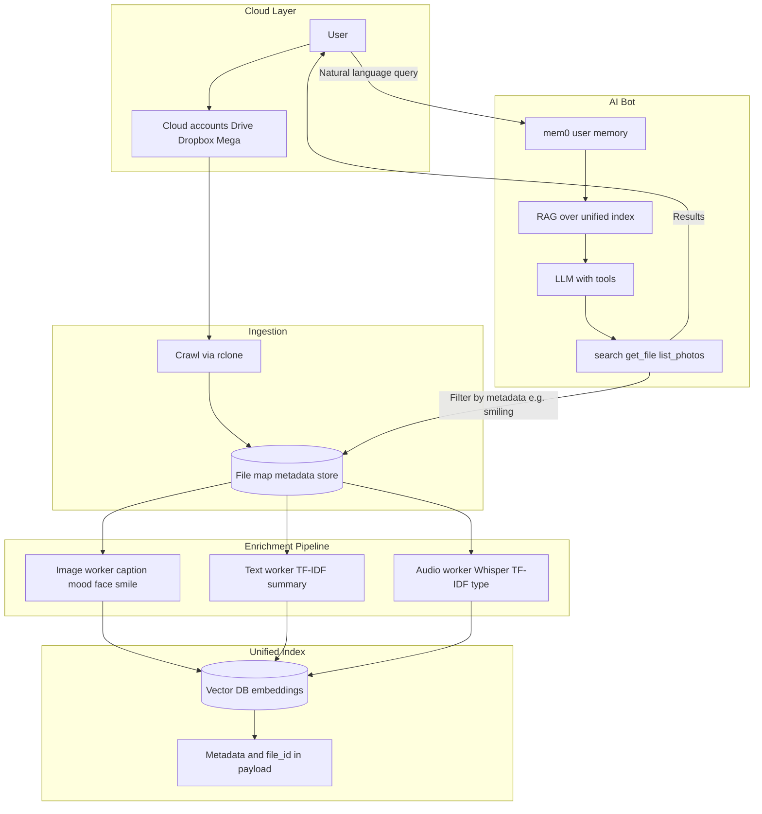

# AI Storage Aggregator

Design the **AI system** for a multi-cloud storage aggregator: N cloud accounts, a unified file map with metadata and contextual enrichment (images, text, audio), and an AI bot with persistent user memory (mem0) for natural-language retrieval—e.g. “happiest moments” returning photos where the user is smiling.

---

## Problem & scope

Design the AI system for an aggregator that connects N cloud storage accounts (Google Drive, Dropbox, Mega, etc.), reads all files, and builds a single large map of files with rich metadata and contextual data. The system enriches each file by type: images get captions and mood/face/smile signals; text documents get summaries and TF-IDF keywords; audio gets transcription, TF-IDF, and type (meeting, music, podcast). All textual context and metadata are aggregated into a unified index so an AI bot can answer natural-language questions and retrieve any file. A mem0-style memory layer remembers the user so queries like “get me the happiest moments of my life” resolve to photos where the user is smiling. Scope: **multi-cloud ingestion**, **file map and enrichment pipeline**, **unified vector + metadata index**, and **AI bot with mem0**; out of scope: building new cloud connectors (use an existing open-source abstraction such as rclone).

---

## Requirements

**Functional (AI and product)**

- User can add N cloud accounts (Google Drive, Dropbox, Mega, etc.) and revoke them.
- The system reads all files from all linked accounts and builds a single **file map** (path, provider, size, mtime, MIME type, content hash) with no duplicate logic across providers.
- For each file, the system produces **contextual data** and stores it in the map: for **images**, a small model yields caption, scene/mood, and optionally face/smile flags; for **text**, extraction plus TF-IDF keywords and optional short summary; for **audio**, transcription (e.g. Whisper), then TF-IDF and optional summary, plus a label for audio type (meeting, music, podcast, etc.).
- When the map and context are ready, an **AI bot** answers natural-language questions and retrieves files (e.g. “find my tax docs”, “show vacation photos from last year”).
- **mem0-style memory**: the system remembers the user (preferences, past queries, “who I am”) so it can interpret “happiest moments of my life” as “photos where I am smiling” and return a gallery filtered by enrichment metadata (e.g. `smiling=true`, `has_face=true`).

**Non-functional (AI design)**

- **Context quality**: Enrichment uses small, effective open-source models (vision, summarization, transcription) so the unified index is both keyword- and semantically searchable; TF-IDF complements embeddings for hybrid retrieval.
- **Latency**: Crawl and enrichment can be async and incremental; query path (mem0 + RAG + LLM + tools) should complete within a few seconds for typical questions.
- **Open source only**: All components—cloud access, embeddings, models, vector DB, memory—are open-source; no proprietary APIs required for core flow.
- **Simplicity**: Architecture is minimal (single file map, single unified index, one bot with tools); avoid overcomplicated pipelines or redundant indices.

---

## High-level architecture

---

## Components

- **Cloud adapter (rclone)** – Single abstraction over 70+ backends (Google Drive, Dropbox, Mega, OneDrive, etc.). Handles OAuth and token refresh per provider. Used to list files (recursive), stream file content for enrichment, and optionally sync. No custom connector code; configuration per account (e.g. named remote in rclone).
- **File map service** – Crawls all configured remotes (per user/account), normalizes paths, and stores one record per file in a metadata store (PostgreSQL or SQLite). Schema: `file_id`, `account_id`, `provider`, `path`, `size`, `mtime`, `mime_type`, `content_hash` (optional, for dedup and idempotency), `enrichment_status`, `enrichment_result` (JSON: caption, keywords, summary, transcript, has_face, smiling, audio_type, etc.). Incremental crawl: only new or changed files (by path + mtime or content_hash) are enqueued for enrichment.
- **Enrichment pipeline (async, queue-based)** – Workers consume a job queue (e.g. Celery + Redis or ARQ). **Image worker**: small vision model (BLIP or BLIP-2) for caption and scene/mood; optional face/smile detector (OpenCV Haar or lightweight Keras/TF) writing `has_face`, `smiling` into `enrichment_result` for “happiest moments” queries. **Text worker**: extract text (by MIME), run TF-IDF (e.g. sklearn) for top-k keywords and optional one-line summary (e.g. FLAN-T5 small). **Audio worker**: Whisper for transcription; same text pipeline (TF-IDF + optional summary) plus a lightweight classifier for audio type (meeting, music, podcast, etc.). Results written back to file map and to the unified index.
- **Unified index** – All textual context (captions, summaries, keywords, transcript snippets) and key metadata are concatenated into a searchable text per file (or per chunk for long docs), embedded with sentence-transformers, and stored in a vector DB (Qdrant or Chroma). Payload includes `file_id`, `account_id`, MIME type, and enrichment flags (e.g. smiling, has_face, audio_type) for filtering. Optional: global TF-IDF index over the same corpus for hybrid (keyword + vector) search.
- **AI bot** – User asks in natural language. **Query path**: (1) **mem0** lookup for user-level memory (preferences, past questions, identity); (2) **RAG**: embed query, vector search (and optionally keyword search) over unified index, return top-k file records with payload; (3) **LLM** (e.g. Ollama with Llama or Mistral) with tools: `search(query, file_types?, date_range?)`, `get_file(file_id)`, `list_photos(where_smiling?, where_face?)`; (4) for “happiest moments” / “photos where I’m smiling”, the LLM calls `list_photos(where_smiling=true, where_face=true)` (or equivalent filter on enrichment metadata); (5) mem0 can be updated with “user asked for happy moments” for future personalization.
- **mem0 integration** – Persistent user-level memory (Apache 2.0). Store facts about the user, past Q&A, and preferences. Injected into the bot context so the bot “remembers” the user and can map “happiest moments” to “photos where I’m smiling” and combine with enriched metadata. Optional session or agent-level memory for the current conversation.

---

## Tech stack (open-source)

| Layer | Choice | Rationale |
|-------|--------|-----------|
| Cloud access | **rclone** (Go, MIT) | One binary, 70+ backends (Drive, Dropbox, Mega, etc.), mature, OAuth support; no custom connectors. |
| Backend / API | **FastAPI** (Python) | Simple async API for account linking, crawl triggers, enrichment status, and bot endpoint. |
| Job queue | **Celery + Redis** or **ARQ** | Async crawl and enrichment without overcomplicating; retries and visibility. |
| Metadata store | **PostgreSQL** or **SQLite** | File map (path, provider, mtime, enrichment_result with has_face, smiling, etc.); SQLite fine for single-user/small scale. |
| Vector DB | **Qdrant** or **Chroma** | Embeddings + payload filter (user_id, type, smiling); both open-source and embeddable. |
| Embeddings | **sentence-transformers** (e.g. all-MiniLM-L6-v2) | Local, good quality/speed; one model for query and index. |
| Images | **BLIP** or **BLIP-2** (caption); **OpenCV Haar** or small **Keras/TF** (smile) | Caption + mood; face/smile for “happiest moments”. |
| Audio | **Whisper** (OpenAI, MIT) | Transcription; then text pipeline. |
| Text | **scikit-learn TfidfVectorizer**; optional **FLAN-T5 small** | Keywords/summary; optional one-line summary. |
| Bot LLM | **Ollama** (Llama 3.2 / Mistral) | Local, tool-calling, no API key. |
| Memory | **mem0** (Apache 2.0) | User memory; plug into bot context. |

---

## Data flow

**Account add and crawl**

1. User adds a cloud account (OAuth or rclone config); backend stores credentials securely and triggers a crawl.
2. Crawl (rclone list) walks the remote, writes/updates file map rows (path, provider, size, mtime, MIME, optional content_hash); new or changed files are enqueued for enrichment.

**Enrichment and indexing**

3. Enrichment workers dequeue jobs by MIME type: images → caption + face/smile; text → TF-IDF + optional summary; audio → Whisper → TF-IDF + type. Results written to file map `enrichment_result` and to the unified index (embed text + metadata, upsert into vector DB).
4. Idempotency: key by `content_hash` or `(account_id, path, mtime)` so re-runs do not duplicate work.

**User query (e.g. “happiest moments”)**

5. User sends a natural-language question. Bot loads **mem0** memories for the user (preferences, “user cares about happy moments”).
6. **RAG**: embed query, search vector DB (and optionally keyword), get top-k file records with payload (file_id, smiling, has_face, etc.).
7. **LLM** with tools: decides to filter photos by `smiling=true` and optionally `has_face=true`, calls `list_photos(where_smiling=true, where_face=true)` (or equivalent). Backend queries file map / index by enrichment metadata and returns list or gallery.
8. Bot responds with the set of photos (and optionally updates mem0 with this interaction).

---

## Back-of-the-envelope

**File map scale**

- Order of 10K–1M files per user across N accounts; metadata store row size ~1–2 KB with enrichment_result JSON; total metadata in the 10 MB–2 GB range per user.

**Unified index**

- One embedding per file (or per chunk for long docs); dimension 384–768; vector DB size on the order of hundreds of MB to low GB per user depending on count and chunking.

**Enrichment time**

- Image: caption ~0.5–2 s per image; face/smile ~0.1–0.5 s. Text: TF-IDF fast; optional summary ~1–3 s per doc. Audio: Whisper ~0.1–1× realtime. Queue throughput and parallelism drive end-to-end backlog.

**Query latency**

- mem0 lookup &lt; 100 ms; vector search &lt; 100 ms; LLM + tool round-trip ~1–5 s; total typical query ~2–6 s.

---

## Trade-offs & interview points

- **rclone vs custom connectors** – rclone gives one abstraction and 70+ backends with minimal code; custom connectors only if a critical provider is unsupported or rate limits need special handling.
- **Single vector index vs per-account** – Single index per user simplifies “search everything” and RAG; per-account indices would allow scoped search and deletion but add complexity; start with one index and scope by `account_id` in payload if needed.
- **TF-IDF vs only embeddings** – TF-IDF adds keyword match and interpretable terms (e.g. for summaries); hybrid (vector + keyword) improves recall for exact phrases and names; optional global TF-IDF index keeps the design simple until needed.
- **Face/smile on all photos vs on-demand** – On-ingestion enrichment gives instant “happiest moments” and consistent metadata; on-demand saves compute but adds latency for that query; recommend on-ingestion for a small, effective detector to keep the pipeline simple.
- **mem0 user-level only vs session-level** – User-level memory is required for “remember me” and “happiest moments”; session or agent-level memory can be added later for multi-turn refinement without changing the core design.

---

## Scaling / failure

- **Crawl rate limits** – Each provider (Drive, Dropbox, Mega) has API limits; throttle crawl per account; back off on 429; resume from last cursor or checkpoint.
- **Enrichment backlog** – Queue can grow if ingestion is faster than workers; scale workers horizontally or prioritize by file type/age; persist job state so crashes do not lose work.
- **Vector index size** – Single collection per user keeps queries simple; if size grows (e.g. millions of chunks), consider sharding by account or time; Qdrant/Chroma support filtering so result set stays manageable.
- **mem0 context length** – Limit number of memories or total tokens injected into the bot prompt; summarize or drop low-relevance memories to avoid overflow.
- **Model availability** – If Whisper, BLIP, or the bot LLM is down or slow, enrichment jobs can retry with backoff; bot can fall back to “search by metadata only” or return a graceful error and suggest retry.
